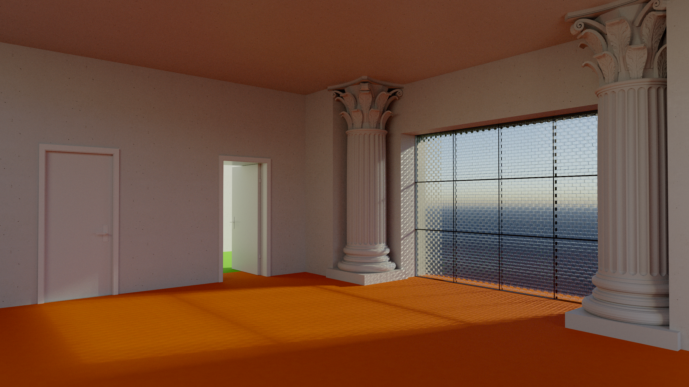
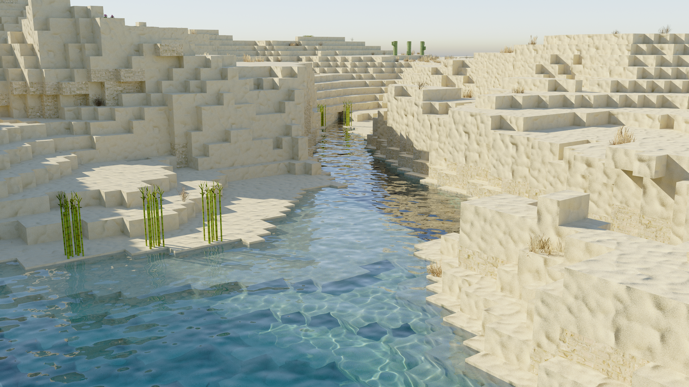
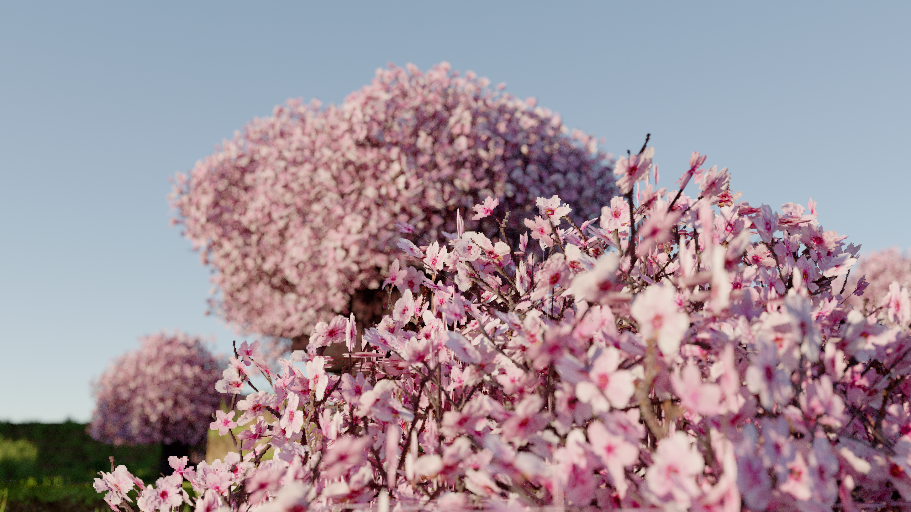
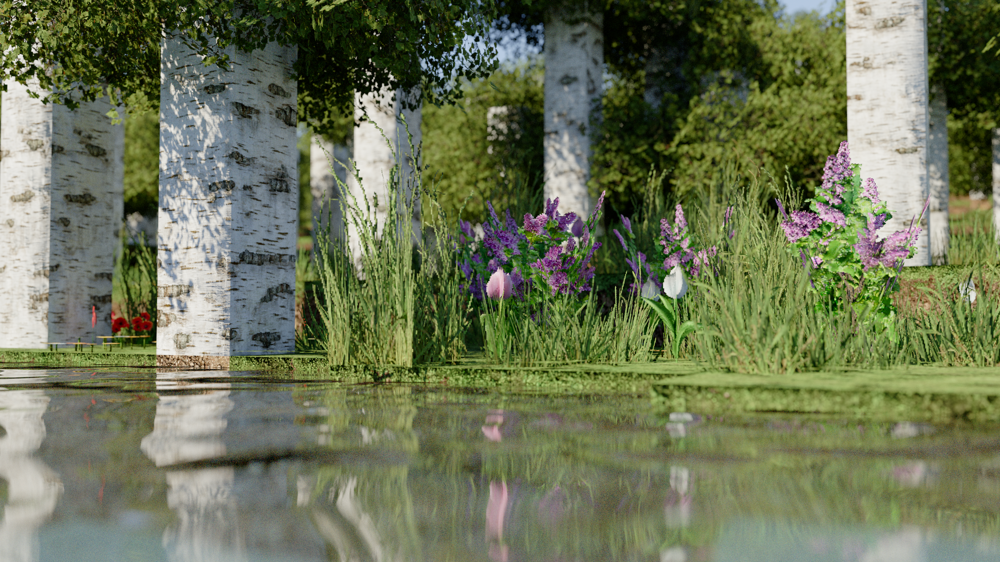
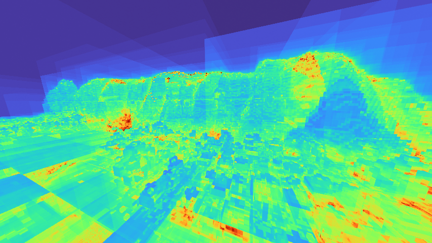

# Camellia

Camellia is a pathtracer shader for Minecraft.
It's my take on Quad Raytracing in Minecraft, using the state of the art techniques from the [H-PLOC paper](https://gpuopen.com/download/HPLOC.pdf) to build a BVH directly on the GPU. 
While I tried my best, performance is still suboptimal and not yet suitable for real-time gameplay. Camellia is intended for research, experimentation, and learning.
It may also straight up not work on AMD. I don't have an AMD card to test it with, sorry!

## Features

- Reference pathracer with spectral-like caustics and DOF.
- QuadRT allows all geometry to be captured and traced correctly, unlike traditional voxel raytracing which compromises with hardcoded models.
- Supports all kinds of blocks, including custom models, entities and players.
- Probably very good mod support, not fully tested.

## Screenshots

*Screenshots taken with [Patrix 256x](https://www.patreon.com/patrix)*

## Requirements

- Minecraft with Iris installed.
- A GPU and driver supporting GLSL 460, compute shaders, SSBOs, custom images, and `GL_KHR_shader_subgroup_*`.
- NVIDIA is fully tested (on a 5080), while AMD and Intel are best-effort targets and are not tested.

## Installation

1. [Download the repository ZIP](https://github.com/xirreal/camellia/archive/refs/heads/main.zip) or from [Modrinth](https://modrinth.com/shader/camellia-shaders) and extract it.
2. Place the extracted Camellia folder in `.minecraft/shaderpacks/`. The pack folder should contain a `shaders/` directory.
3. Select Camellia in Iris's Shader Packs menu.

## License

Special thanks to sixthsurge for allowing me to use their clouds in my shader! Check out [Photon](https://github.com/sixthsurge/photon) for a surprisingly fast and stunning realtime shader.

Camellia's original work is shared under the source-available license in [`LICENSE`](LICENSE); it is not an open-source license. Third-party code and research remain under their own terms. See [`THIRD_PARTY_NOTICES.md`](THIRD_PARTY_NOTICES.md) and [`licenses/`](licenses/).

I want people to learn from Camellia (especially what is wrong with it) so the license allows you to read and modify the source code for personal use. If you want to publish a derivative, you must contact me for permission. See the license for details.

## Support development

If Camellia is useful to you, [sponsor me on GitHub](https://github.com/sponsors/xirreal).[Check out my other projects too!](https://xirreal.dev/projects)
